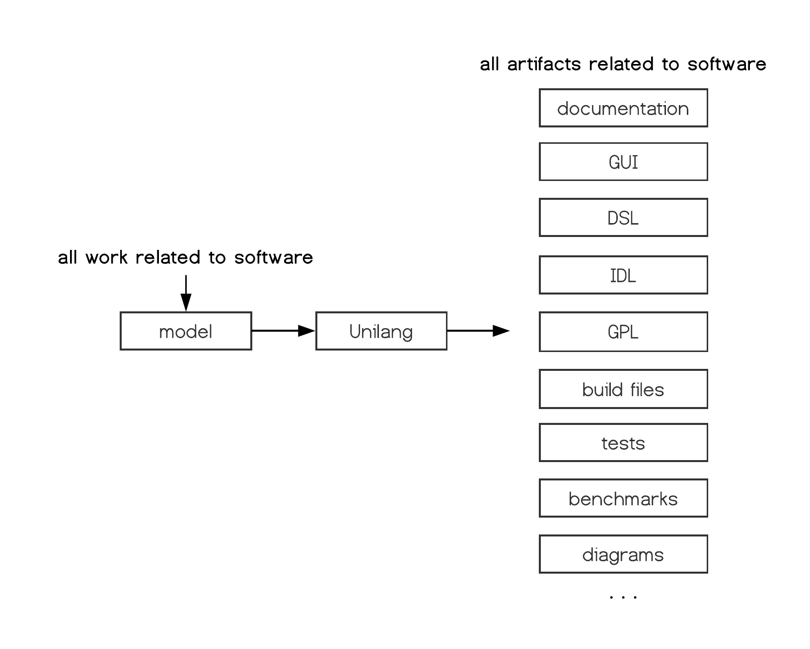

	

**A universal programming language**

# Introduction

## Overview
Welcome to the world of Unilang.  We'll start by getting you acquainted with the big picture.  Unilang is a tool for writing software.  And like all tools in software, it takes an input and produces an output.  The scope of unilang's throughput is ambitious yet necessary.  Everything a software engineer can express around a problem domain must be encoded in the same ontology.  The output of that ontology is every chosen artifact that facilitates desired tasks in that domain.  From a programming perspective, we unify all of the formal and informal languages involved in software development.  This information forms a single abstract model which is used to create various artifacts.  

This explanation may appear imprecise.  Consider the transformation process of source code to other languages.  The scope of these other languages often do not entail all of the work that needs to be done for software in a real-world context.  

Much like other general purpose programming languages (GPLs), Unilang can be used to generate programs for any domain.  A key feature of unilang is that it can target source code of other languages.  In this regard, Unilang will act as a transcompiler to other programming languages.  

There are many other types of artifacts that should be created alongside software.  Unilang facilitates the creation of all related artifacts.  

What you are reading right now was generated from Unilang.  

## Motivation
TODO.  

### Practical
TODO.  

### Personal
TODO.  

# Language Design
In this section, we will discuss the theory of what a programming language should be.  We show how these ideas are applied in shaping the design of unilang.  

## The hierarchy of language
Consider the current language abstractions within the software engineering domain.  Unilang and its conceptual model are placed above these high level languages.  

Unilang can transcompile down to other languages.  

## The structure of language
Many programming languages represent their syntactic structure as an abstract syntax tree.  Other languages like Lisp and its derivations choose nested lists.  The structure of unilang is a composed set of algebraic data types.  

This is a subtle but important distinction.  An ADT models the concise structure and shape of programming concepts.  This allows us to work backwards and enable programmers to efficiently populate this structure.  Trying to contort a variety of programming concepts syntactically, and then extracting them out with regular expressions and grammars into generic data structures such as trees and lists has proven insufficient for semantic analysis.  Its the reason that parsing errors are often confusing and unhelpful.  Its the reason that community tooling on code transformation is often limited.  Most importantly, its the reason a language's evolution tends to stagnate as more abstract concepts are squeezed into an existing syntax and grammar.  

## The look of language
TODO. this is where we talk about discrete infinity.  
